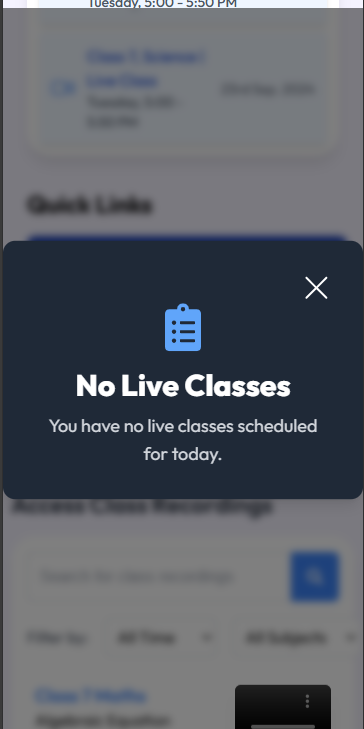

## Screenshots

### Dashboard UI (Desktop)


### Modal UI (Desktop)


### Dashboard UI (Mobile)


### Modal UI (Mobile)


### Quick Links (Mobile)


## Project Overview
This is a **responsive dashboard** built with **Next.js** that includes various components such as a **navbar**, **announcement section**, **class schedules**, **quick links**, and **modals**. The UI is optimized for both **desktop and mobile** users, ensuring a seamless experience.


## Features
- Responsive design for both mobile and desktop views.
- Interactive modal for user actions.
- Optimized for performance with Next.js server-side rendering.
- Clean and intuitive UI with a focus on user experience.


This is a [Next.js](https://nextjs.org) project bootstrapped with [`create-next-app`](https://github.com/vercel/next.js/tree/canary/packages/create-next-app).

## Getting Started

First, run the development server:

```bash
npm run dev
# or
yarn dev
# or
pnpm dev
# or
bun dev
```

Open [http://localhost:3000](http://localhost:3000) with your browser to see the result.

You can start editing the page by modifying `app/page.js`. The page auto-updates as you edit the file.

This project uses [`next/font`](https://nextjs.org/docs/app/building-your-application/optimizing/fonts) to automatically optimize and load [Geist](https://vercel.com/font), a new font family for Vercel.

## Learn More

To learn more about Next.js, take a look at the following resources:

- [Next.js Documentation](https://nextjs.org/docs) - learn about Next.js features and API.
- [Learn Next.js](https://nextjs.org/learn) - an interactive Next.js tutorial.

You can check out [the Next.js GitHub repository](https://github.com/vercel/next.js) - your feedback and contributions are welcome!

## Deploy on Vercel

The easiest way to deploy your Next.js app is to use the [Vercel Platform](https://vercel.com/new?utm_medium=default-template&filter=next.js&utm_source=create-next-app&utm_campaign=create-next-app-readme) from the creators of Next.js.

Check out our [Next.js deployment documentation](https://nextjs.org/docs/app/building-your-application/deploying) for more details.
